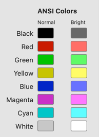

# Convert iTerm2 profile colors to RGB dataset

As a user of iTerm2 and a developer that wants to use python packages supporting colorization 
such as [Rich](), I want to extract the colors from my iTerm2 Profile into an RGB dataset 
that provides:

   * Background (R,G,B)
   * Foreground (R,G,B)
   * List of 8 "normal" colors of (R, G, B)
   * List of 8 "bright" colors of (R, G, B)
   
# Usage

You will first need to export your profile colors from iTerm, as described in the section
below. You can then either use this package directly or programaticaly.

**direct module**<br/>
Consider an iTerm profile with color values that look like this in the app:




After exporting these settings to the default filename "Untitled.itemcolors",
run python:

```
python -m iterm2_colors2rgb Untitled.itermcolors
```   

Outputs:
````
[[0, 0, 0], [199, 199, 199], [[0, 0, 0], [201, 27, 0], [0, 194, 0], [199, 196, 0], [2, 37, 199], [202, 48, 199], [0, 197, 199], [199, 199, 199], [104, 104, 104]], [[255, 110, 103], [95, 250, 104], [255, 252, 103], [104, 113, 255], [255, 119, 255], [96, 253, 255], [255, 255, 255]]]
````
# Installation

```
pip install iterm2-colors2rgb
```  

# Exporting 